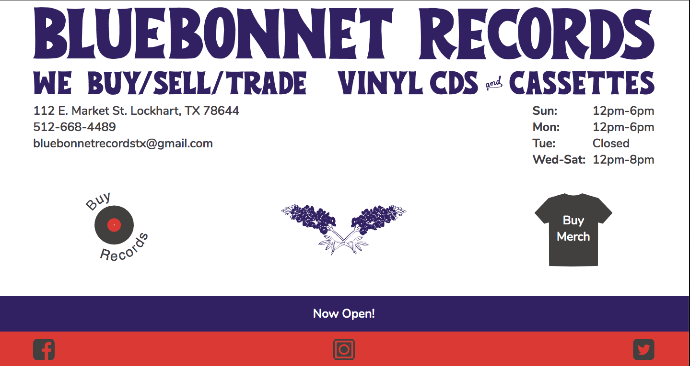

# Bluebonnet Records

_Bluebonnet Records_ is a fully mobile-responsive website created for the client, Bluebonnet Records, a record store located in Lockhart, TX. The layout clearly presents shop details, links to maps, social media, and stores. Announcements and store updates are pulled from a markdown file using Google Sheets. The website is built with JavaScript, CSS3, HTML, Node.js, Webpack, SVGs, and Google Sheets.

## Getting Started

The following instructions will get you a copy of the project up and running on your local machine for development and testing purposes.

### Installation

Please clone and download this folder to your hard disk and install dependencies using `npm install`.

## Functionality

Bluebonnet Records uses Webpack for module bundling and minification. Run `npm run dev` to initiate the development server on your machine.

🚀 This design was deployed as the company's first website for a year, launching in mid-2019, however this version is no longer active

## Built With

- JavaScript
- Node.js
- CSS
- HTML
- Webpack

